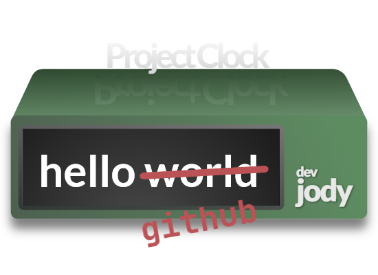

<h1 align="center">Hi there 👋 I'm Jody... aka devJody!</h1>

BEng Design Engineer 📐 turned...  <strong>Software Developer 💻 & Digital Creator</strong> 🎨

<table>
  <tr>
    <th>_  &nbsp &nbsp &nbsp     🔭 I’m currently working on ...</th>
    <td>MERN | WinForms | OOP | CSharp</td>
  </tr>
  <tr>
    <th>_      🌱 I’m currently learning ...</th>
    <td>Javascript | React | CSharp | OOP</td>
  </tr>
  <tr>
    <th>_        👯 I’m looking to collaborate on ...</th>
    <td>eating Sushi and/or Pizza.</td>
  </tr>
  <tr>
    <th>_       🤔 I’m looking for help with ...</th>
    <td>closing my Skip the Dishes App.</td>
  </tr>
  <tr>
    <th>_        📫 How to reach me: ...</th>
    <td><a href="https://twitter.com/dev_jody">Twitter</a></td>
  </tr>
</table>

<h3 align="center">I hope you enjoy a looking around...please don't forget to add me on Twitter!</h3> 

<!--
**devjody/devjody** is a ✨ _special_ ✨ repository because its `README.md` (this file) appears on your GitHub profile.-->
